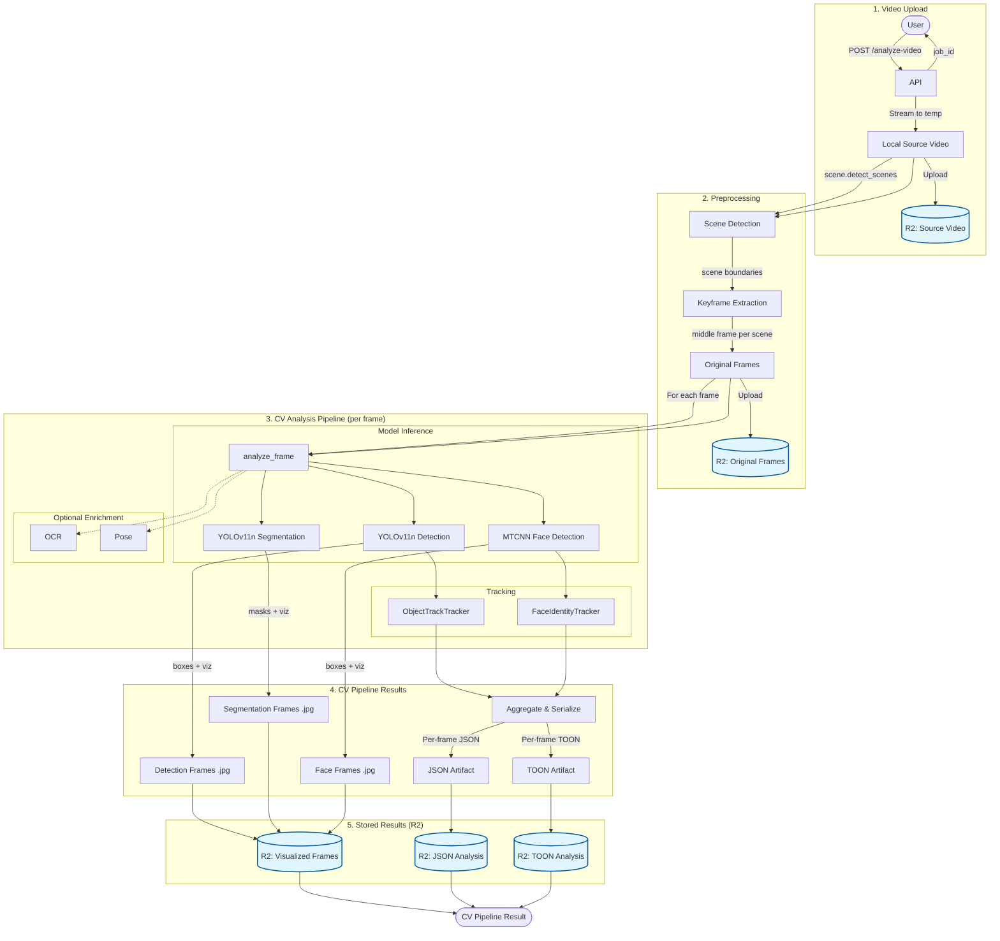

# Video Analysis Pipeline

End-to-end CV pipeline workflow: video upload → preprocessing → per-frame analysis → processed results.

```mermaid
flowchart TD
    %% Styling
    classDef storage fill:#e1f5fe,stroke:#01579b,stroke-width:2px;
    classDef process fill:#f3e5f5,stroke:#4a148c,stroke-width:2px;
    classDef script fill:#fff3e0,stroke:#e65100,stroke-width:2px;
    classDef output fill:#e8f5e9,stroke:#1b5e20,stroke-width:2px;

    %% Stage 1: Upload & Ingestion
    subgraph Upload ["1. Video Upload"]
        User([User]) -->|POST /analyze-video| API[API]
        API -->|job_id| User
        API -->|Stream to temp| LocalVideo[Local Source Video]
        LocalVideo -->|Upload| R2_Source[("R2: Source Video")]:::storage
    end

    %% Stage 2: Preprocessing
    subgraph Preprocess ["2. Preprocessing"]
        LocalVideo -->| scene.detect_scenes | SceneDetect[Scene Detection]
        SceneDetect -->|scene boundaries| KeyframeExtract[Keyframe Extraction]
        KeyframeExtract -->|middle frame per scene| LocalFrames[Original Frames]
        LocalFrames -->|Upload| R2_Frames[("R2: Original Frames")]:::storage
    end

    %% Stage 3: CV Analysis (per frame)
    subgraph CV ["3. CV Analysis Pipeline (per frame)"]
        direction TB
        LocalFrames -->|For each frame| AnalyzeFrame[analyze_frame]
        
        subgraph Models ["Model Inference"]
            AnalyzeFrame --> YOLODet[YOLOv11n Detection]
            AnalyzeFrame --> YOLOSeg[YOLOv11n Segmentation]
            AnalyzeFrame --> MTCNN[MTCNN Face Detection]
        end
        
        subgraph Tracking ["Tracking"]
            YOLODet --> ObjTracker[ObjectTrackTracker]
            MTCNN --> FaceTracker[FaceIdentityTracker]
        end
        
        subgraph Optional ["Optional Enrichment"]
            AnalyzeFrame -.-> OCR[OCR]
            AnalyzeFrame -.-> Pose[Pose]
        end
    end

    %% Stage 4: CV Outputs
    subgraph Outputs ["4. CV Pipeline Results"]
        YOLODet -->|boxes + viz| DetFrames[Detection Frames .jpg]
        YOLOSeg -->|masks + viz| SegFrames[Segmentation Frames .jpg]
        MTCNN -->|boxes + viz| FaceFrames[Face Frames .jpg]
        
        ObjTracker & FaceTracker --> Agg[Aggregate & Serialize]
        Agg -->|Per-frame JSON| JSON[JSON Artifact]
        Agg -->|Per-frame TOON| TOON[TOON Artifact]
    end

    %% Stage 5: Persisted Results
    subgraph Storage ["5. Stored Results (R2)"]
        DetFrames & SegFrames & FaceFrames --> R2_Vis[("R2: Visualized Frames")]:::storage
        JSON --> R2_JSON[("R2: JSON Analysis")]:::storage
        TOON --> R2_TOON[("R2: TOON Analysis")]:::storage
    end

    %% Flow connections
    LocalVideo --> SceneDetect
    LocalFrames --> AnalyzeFrame
    R2_Vis & R2_JSON & R2_TOON --> Result([CV Pipeline Result])
```
