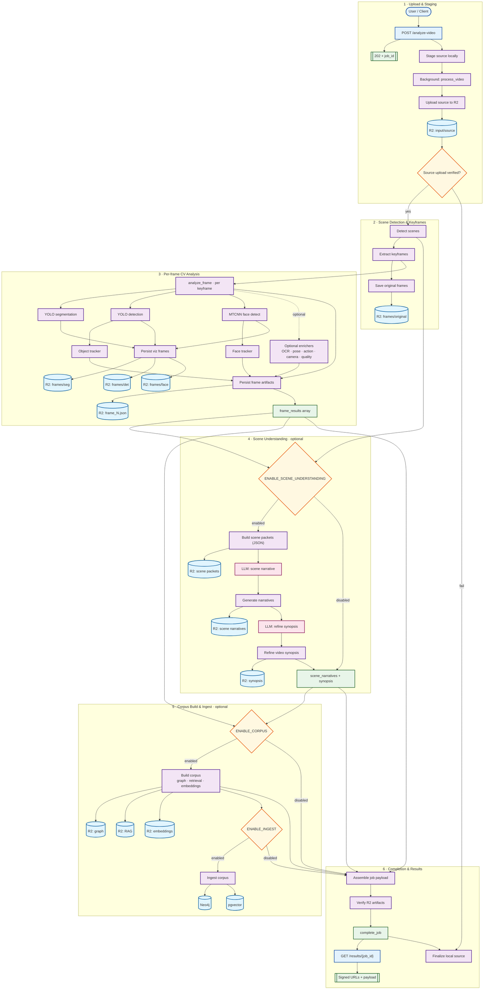

# Video Analysis Pipeline

End-to-end workflow: upload/stage video -> per-frame CV analysis -> optional scene understanding -> optional corpus build/ingest -> signed results.

```mermaid
flowchart TD
    %% Styling
    classDef api fill:#e3f2fd,stroke:#0d47a1,stroke-width:2px
    classDef process fill:#f3e5f5,stroke:#4a148c,stroke-width:2px
    classDef decision fill:#fff8e1,stroke:#e65100,stroke-width:2px
    classDef storage fill:#e1f5fe,stroke:#01579b,stroke-width:2px
    classDef output fill:#e8f5e9,stroke:#1b5e20,stroke-width:2px
    classDef llm fill:#fce4ec,stroke:#880e4f,stroke-width:2px

    %% ── Stage 1: Upload & Staging ──
    subgraph S1[" 1 · Upload & Staging "]
        User([User / Client]):::api
        AnalyzeEndpoint[POST /analyze-video]:::api
        ReturnJob[[202 + job_id]]:::output
        LocalStage[Stage source locally]:::process
        ProcessVideo[Background: process_video]:::process
        UploadSource[Upload source to R2]:::process
        R2Source[(R2: input/source)]:::storage
        VerifySource{Source upload verified?}:::decision

        User --> AnalyzeEndpoint
        AnalyzeEndpoint --> ReturnJob
        AnalyzeEndpoint --> LocalStage
        LocalStage --> ProcessVideo
        ProcessVideo --> UploadSource
        UploadSource --> R2Source
        R2Source --> VerifySource
    end

    %% ── Stage 2: Scene Detection & Keyframes ──
    subgraph S2[" 2 · Scene Detection & Keyframes "]
        SceneDetect[Detect scenes]:::process
        KeyframeExtract[Extract keyframes]:::process
        SaveOriginal[Save original frames]:::process
        R2Original[(R2: frames/original)]:::storage

        SceneDetect --> KeyframeExtract
        KeyframeExtract --> SaveOriginal
        SaveOriginal --> R2Original
    end

    VerifySource -->|yes| SceneDetect

    %% ── Stage 3: Per-frame CV Analysis ──
    subgraph S3[" 3 · Per-frame CV Analysis "]
        AnalyzeFrame[analyze_frame · per keyframe]:::process

        YOLOSeg[YOLO segmentation]:::process
        YOLODet[YOLO detection]:::process
        MTCNN[MTCNN face detect]:::process

        ObjTrack[Object tracker]:::process
        FaceTrack[Face tracker]:::process
        Enrichment["Optional enrichers<br/>OCR · pose · action · camera · quality"]:::process

        PersistViz[Persist viz frames]:::process
        R2Seg[(R2: frames/seg)]:::storage
        R2Det[(R2: frames/det)]:::storage
        R2Face[(R2: frames/face)]:::storage

        PersistArtifacts[Persist frame artifacts]:::process
        R2FrameJSON[(R2: frame_N.json)]:::storage
        FrameResults[frame_results array]:::output

        AnalyzeFrame --> YOLOSeg
        AnalyzeFrame --> YOLODet
        AnalyzeFrame --> MTCNN
        AnalyzeFrame -. optional .-> Enrichment
        YOLODet --> ObjTrack
        MTCNN --> FaceTrack

        YOLOSeg --> PersistViz
        YOLODet --> PersistViz
        MTCNN --> PersistViz
        PersistViz --> R2Seg
        PersistViz --> R2Det
        PersistViz --> R2Face

        AnalyzeFrame --> PersistArtifacts
        ObjTrack --> PersistArtifacts
        FaceTrack --> PersistArtifacts
        Enrichment --> PersistArtifacts
        PersistArtifacts --> R2FrameJSON
        PersistArtifacts --> FrameResults
    end

    KeyframeExtract --> AnalyzeFrame

    %% ── Stage 4: Scene Understanding (optional) ──
    subgraph S4[" 4 · Scene Understanding · optional "]
        SceneGate{ENABLE_SCENE_UNDERSTANDING}:::decision
        BuildScenePackets["Build scene packets (JSON)"]:::process
        R2ScenePackets[(R2: scene packets)]:::storage
        SceneNarrativeLLM[LLM: scene narrative]:::llm
        GenerateNarratives[Generate narratives]:::process
        R2SceneNarratives[(R2: scene narratives)]:::storage
        SynopsisLLM[LLM: refine synopsis]:::llm
        BuildSynopsis[Refine video synopsis]:::process
        R2Synopsis[(R2: synopsis)]:::storage
        SceneOutputs[scene_narratives + synopsis]:::output

        SceneGate -->|enabled| BuildScenePackets
        BuildScenePackets --> R2ScenePackets
        BuildScenePackets --> SceneNarrativeLLM
        SceneNarrativeLLM --> GenerateNarratives
        GenerateNarratives --> R2SceneNarratives
        GenerateNarratives --> SynopsisLLM
        SynopsisLLM --> BuildSynopsis
        BuildSynopsis --> R2Synopsis
        BuildSynopsis --> SceneOutputs
        SceneGate -->|disabled| SceneOutputs
    end

    SceneDetect --> SceneGate
    FrameResults --> SceneGate

    %% ── Stage 5: Corpus Build & Ingest (optional) ──
    subgraph S5[" 5 · Corpus Build & Ingest · optional "]
        CorpusGate{ENABLE_CORPUS}:::decision
        BuildCorpus["Build corpus<br/>graph · retrieval · embeddings"]:::process
        R2Graph[(R2: graph)]:::storage
        R2Retrieval[(R2: RAG)]:::storage
        R2Embeddings[(R2: embeddings)]:::storage
        IngestGate{ENABLE_INGEST}:::decision
        IngestCorpus[Ingest corpus]:::process
        Neo4j[(Neo4j)]:::storage
        Pgvector[(pgvector)]:::storage

        CorpusGate -->|enabled| BuildCorpus
        BuildCorpus --> R2Graph
        BuildCorpus --> R2Retrieval
        BuildCorpus --> R2Embeddings
        BuildCorpus --> IngestGate
        IngestGate -->|enabled| IngestCorpus
        IngestCorpus --> Neo4j
        IngestCorpus --> Pgvector
    end

    FrameResults --> CorpusGate
    SceneOutputs --> CorpusGate

    %% ── Stage 6: Completion & Results ──
    subgraph S6[" 6 · Completion & Results "]
        AssemblePayload[Assemble job payload]:::process
        VerifyArtifacts[Verify R2 artifacts]:::process
        CompleteJob[complete_job]:::output
        ResultsEndpoint["GET /results/{job_id}"]:::api
        SignedResult[[Signed URLs + payload]]:::output
        FinalizeSource[Finalize local source]:::process

        AssemblePayload --> VerifyArtifacts
        VerifyArtifacts --> CompleteJob
        CompleteJob --> ResultsEndpoint
        ResultsEndpoint --> SignedResult
        CompleteJob --> FinalizeSource
    end

    FrameResults --> AssemblePayload
    SceneOutputs --> AssemblePayload
    BuildCorpus --> AssemblePayload
    CorpusGate -->|disabled| AssemblePayload
    IngestGate -->|disabled| AssemblePayload
    VerifySource -->|fail| FinalizeSource
```
