# Video Analysis Pipeline

End-to-end workflow: upload/stage video -> per-frame CV analysis -> video-level tracking -> optional face identity -> optional scene understanding -> optional corpus build/ingest -> signed results.

Scene understanding uses Gemini for narrative and synopsis generation (default: `gemini-3-flash-preview`; override via `SCENE_MODEL_ID` / `SYNOPSIS_MODEL_ID`). Execution can run **in-process** (default) or via a persistent **task queue** with a separate `SceneAIWorker` (`SCENE_AI_EXECUTION_MODE=queue`). Optional LangGraph orchestration with sequential fallback.

Face identity uses `EdgeFaceTorchEmbedder` for embedding-based clustering (default on; toggle via `ENABLE_FACE_IDENTITY_PIPELINE`).

Frame analysis artifacts are JSON-only (TOON format support has been removed).

```mermaid
flowchart TD
    %% Styling
    classDef api fill:#e3f2fd,stroke:#0d47a1,stroke-width:2px
    classDef process fill:#f3e5f5,stroke:#4a148c,stroke-width:2px
    classDef decision fill:#fff8e1,stroke:#e65100,stroke-width:2px
    classDef storage fill:#e1f5fe,stroke:#01579b,stroke-width:2px
    classDef output fill:#e8f5e9,stroke:#1b5e20,stroke-width:2px
    classDef llm fill:#fce4ec,stroke:#880e4f,stroke-width:2px
    classDef worker fill:#fff3e0,stroke:#e65100,stroke-width:2px

    %% ── Stage 1: Upload & Staging ──
    subgraph S1[" 1 · Upload & Staging "]
        User([User / Client]):::api
        AnalyzeEndpoint[POST /analyze-video]:::api
        ReturnJob[[202 + job_id]]:::output
        LocalStage[Stage source locally]:::process
        ProcessVideo[Background: process_video]:::process
        UploadSource[Upload source to R2]:::process
        R2Source[(R2: input/source)]:::storage
        VerifySource{Source upload verified?}:::decision

        User --> AnalyzeEndpoint
        AnalyzeEndpoint --> ReturnJob
        AnalyzeEndpoint --> LocalStage
        LocalStage --> ProcessVideo
        ProcessVideo --> UploadSource
        UploadSource --> R2Source
        R2Source --> VerifySource
    end

    %% ── Stage 2: Scene Detection & Keyframes ──
    subgraph S2[" 2 · Scene Detection & Keyframes "]
        SceneDetect[Detect scenes]:::process
        KeyframeExtract[Extract keyframes]:::process
        SaveOriginal[Save original frames]:::process
        R2Original[(R2: frames/original)]:::storage

        SceneDetect --> KeyframeExtract
        KeyframeExtract --> SaveOriginal
        SaveOriginal --> R2Original
    end

    VerifySource -->|yes| SceneDetect

    %% ── Stage 3: Per-frame CV Analysis ──
    subgraph S3[" 3 · Per-frame CV Analysis "]
        AnalyzeFrame[analyze_frame · per keyframe]:::process

        YOLOSeg[YOLO segmentation]:::process
        YOLODet[YOLO detection]:::process
        MTCNN[MTCNN face detect]:::process

        ObjTrack[Object tracker]:::process
        FaceTrack[Face tracker]:::process
        Enrichment["Optional enrichers<br/>OCR · pose · action · camera · quality"]:::process
        EvidenceAnchors[Build evidence anchors]:::process

        PersistViz[Persist viz frames]:::process
        R2Seg[(R2: frames/seg)]:::storage
        R2Det[(R2: frames/det)]:::storage
        R2Face[(R2: frames/face)]:::storage

        PersistArtifacts["Persist frame artifacts (JSON)"]:::process
        R2FrameJSON[(R2: analysis/json/frame_N.json)]:::storage
        FrameResults[frame_results array]:::output

        AnalyzeFrame --> YOLOSeg
        AnalyzeFrame --> YOLODet
        AnalyzeFrame --> MTCNN
        AnalyzeFrame -. optional .-> Enrichment
        YOLODet --> ObjTrack
        MTCNN --> FaceTrack

        YOLOSeg --> PersistViz
        YOLODet --> PersistViz
        MTCNN --> PersistViz
        PersistViz --> R2Seg
        PersistViz --> R2Det
        PersistViz --> R2Face

        ObjTrack --> EvidenceAnchors
        FaceTrack --> EvidenceAnchors
        Enrichment --> EvidenceAnchors
        EvidenceAnchors --> PersistArtifacts
        AnalyzeFrame --> PersistArtifacts
        PersistArtifacts --> R2FrameJSON
        PersistArtifacts --> FrameResults
    end

    KeyframeExtract --> AnalyzeFrame

    %% ── Stage 3.5: Video-Level Tracking & Face Identity ──
    subgraph S35[" 3.5 · Video-Level Tracking & Face Identity "]
        ObjTrackSummary[Object tracking summary]:::process
        ObjTrackResult[video_object_tracks]:::output

        FaceGate{ENABLE_FACE_IDENTITY_PIPELINE}:::decision
        TrackingFrames["Extract tracking frames<br/>(high-FPS sampling)"]:::process
        Embedder["EdgeFaceTorchEmbedder<br/>face embeddings"]:::process
        SceneClustering[Scene-local identity clustering]:::process
        VideoClustering[Video-global identity stitching]:::process
        FaceIdentityResult[video_face_identities]:::output

        PersonFusion["Person tracking fusion<br/>(object + face → person tracks)"]:::process
        PersonTrackResult[video_person_tracks]:::output

        ObjTrackSummary --> ObjTrackResult

        FaceGate -->|enabled| TrackingFrames
        TrackingFrames --> Embedder
        Embedder --> SceneClustering
        SceneClustering --> VideoClustering
        VideoClustering --> FaceIdentityResult
        VideoClustering --> PersonFusion
        PersonFusion --> PersonTrackResult
        FaceGate -->|disabled| PersonTrackResult
    end

    FrameResults --> ObjTrackSummary
    FrameResults --> FaceGate
    SceneDetect --> TrackingFrames

    %% ── Stage 4: Scene Understanding (optional) ──
    subgraph S4[" 4 · Scene Understanding · optional "]
        SceneGate{ENABLE_SCENE_UNDERSTANDING}:::decision

        subgraph S4exec[" Execution Mode "]
            ExecMode{SCENE_AI_EXECUTION_MODE}:::decision

            %% In-process path
            InProcess[In-process execution]:::process
            BuildScenePackets["Build scene packets (JSON)"]:::process
            R2ScenePackets[(R2: scene packets)]:::storage
            SceneNarrativeLLM[LLM: scene narrative]:::llm
            GenerateNarratives[Generate narratives]:::process
            R2SceneNarratives[(R2: scene narratives)]:::storage
            SynopsisLLM[LLM: refine synopsis]:::llm
            BuildSynopsis[Refine video synopsis]:::process
            R2Synopsis[(R2: synopsis)]:::storage
            LangGraphNote["LangGraph orchestration<br/>(optional, sequential fallback)"]:::process

            ExecMode -->|in_process| InProcess
            InProcess --> LangGraphNote
            LangGraphNote --> BuildScenePackets
            BuildScenePackets --> R2ScenePackets
            BuildScenePackets --> SceneNarrativeLLM
            SceneNarrativeLLM --> GenerateNarratives
            GenerateNarratives --> R2SceneNarratives
            GenerateNarratives --> SynopsisLLM
            SynopsisLLM --> BuildSynopsis
            BuildSynopsis --> R2Synopsis

            %% Queue path
            EnqueueTask["Enqueue task<br/>(Postgres / in-memory)"]:::worker
            WaitStage["Job stage: waiting_scene_ai"]:::output
            SceneWorker["SceneAIWorker<br/>(separate process, polling)"]:::worker
            ClaimTask[Claim task with lease]:::worker
            WorkerExec["Execute scene pipeline<br/>(packets → narratives → synopsis)"]:::process
            Provenance["Attach worker provenance"]:::process
            RetryLogic{"Retry / dead-letter<br/>fallback policy"}:::decision

            ExecMode -->|queue| EnqueueTask
            EnqueueTask --> WaitStage
            SceneWorker --> ClaimTask
            ClaimTask --> WorkerExec
            WorkerExec --> Provenance
            WorkerExec -.->|failure| RetryLogic
        end

        SceneOutputs[scene_narratives + synopsis]:::output

        SceneGate -->|enabled| ExecMode
        BuildSynopsis --> SceneOutputs
        Provenance --> SceneOutputs
        RetryLogic -->|fallback_empty| SceneOutputs
        SceneGate -->|disabled| SceneOutputs
    end

    SceneDetect --> SceneGate
    FrameResults --> SceneGate

    %% ── Stage 5: Corpus Build & Ingest (optional) ──
    subgraph S5[" 5 · Corpus Build & Ingest · optional "]
        CorpusGate{ENABLE_CORPUS}:::decision
        BuildCorpus["Build corpus<br/>graph · retrieval · embeddings"]:::process
        R2Graph[(R2: graph)]:::storage
        R2Retrieval[(R2: RAG)]:::storage
        R2Embeddings[(R2: embeddings)]:::storage
        IngestGate{ENABLE_INGEST}:::decision
        IngestCorpus[Ingest corpus]:::process
        Neo4j[(Neo4j)]:::storage
        Pgvector[(pgvector)]:::storage

        CorpusGate -->|enabled| BuildCorpus
        BuildCorpus --> R2Graph
        BuildCorpus --> R2Retrieval
        BuildCorpus --> R2Embeddings
        BuildCorpus --> IngestGate
        IngestGate -->|enabled| IngestCorpus
        IngestCorpus --> Neo4j
        IngestCorpus --> Pgvector
    end

    FrameResults --> CorpusGate
    SceneOutputs --> CorpusGate

    %% ── Stage 6: Completion & Results ──
    subgraph S6[" 6 · Completion & Results "]
        AssemblePayload[Assemble job payload]:::process
        VerifyArtifacts[Verify R2 artifacts]:::process
        CompleteJob[complete_job]:::output
        ResultsEndpoint["GET /results/{job_id}"]:::api
        SignedResult[["Signed URLs + payload<br/>(frames · scenes · corpus ·<br/>face IDs · person tracks · object tracks)"]]:::output
        FinalizeSource[Finalize local source]:::process

        AssemblePayload --> VerifyArtifacts
        VerifyArtifacts --> CompleteJob
        CompleteJob --> ResultsEndpoint
        ResultsEndpoint --> SignedResult
        CompleteJob --> FinalizeSource
    end

    FrameResults --> AssemblePayload
    SceneOutputs --> AssemblePayload
    ObjTrackResult --> AssemblePayload
    FaceIdentityResult --> AssemblePayload
    PersonTrackResult --> AssemblePayload
    BuildCorpus --> AssemblePayload
    CorpusGate -->|disabled| AssemblePayload
    IngestGate -->|disabled| AssemblePayload
    VerifySource -->|fail| FinalizeSource
```

